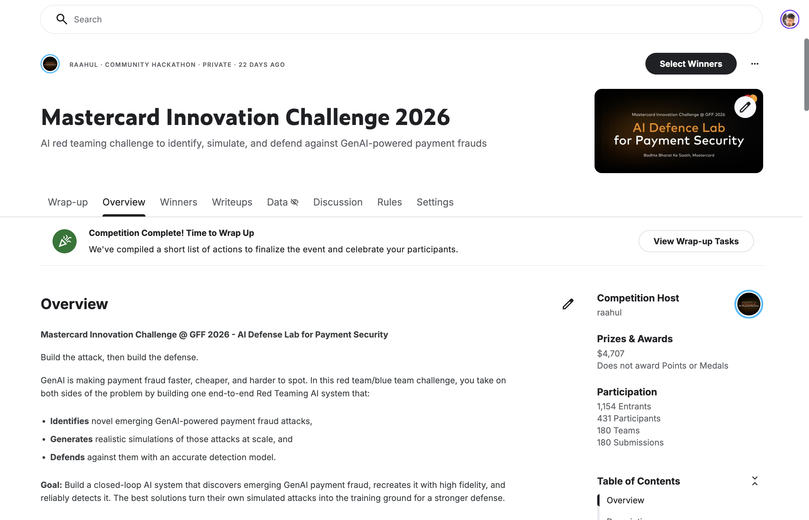
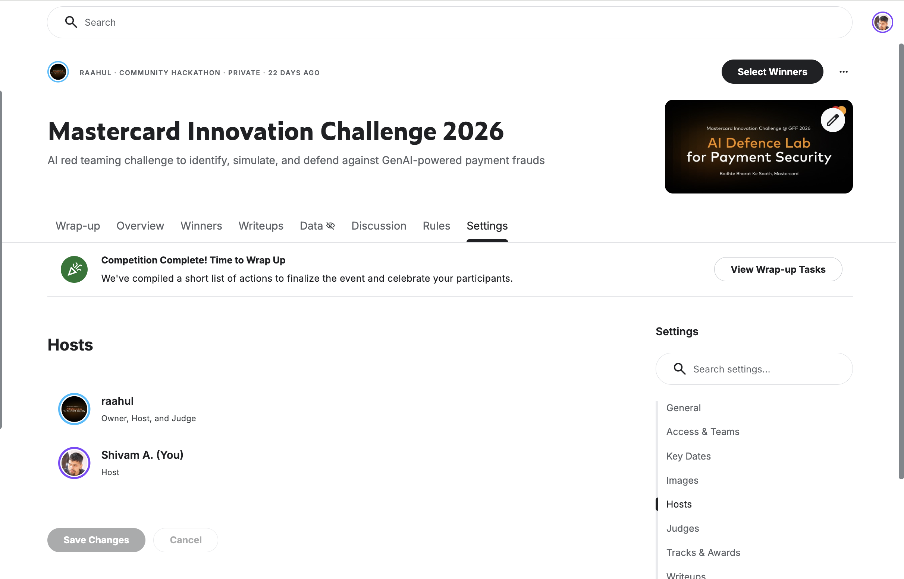
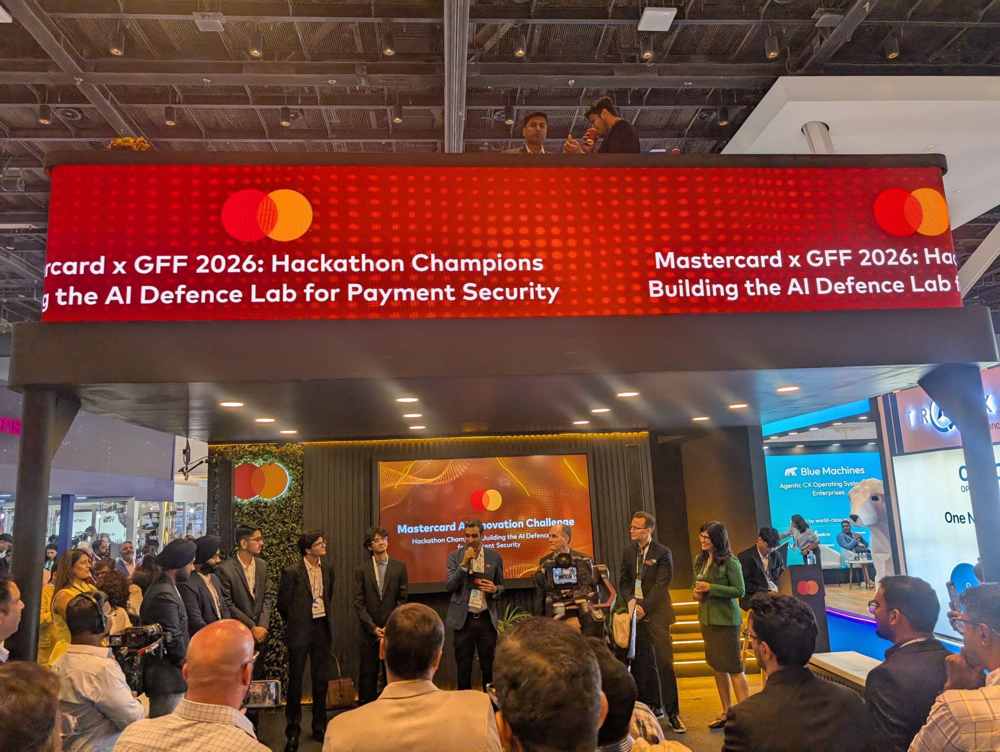
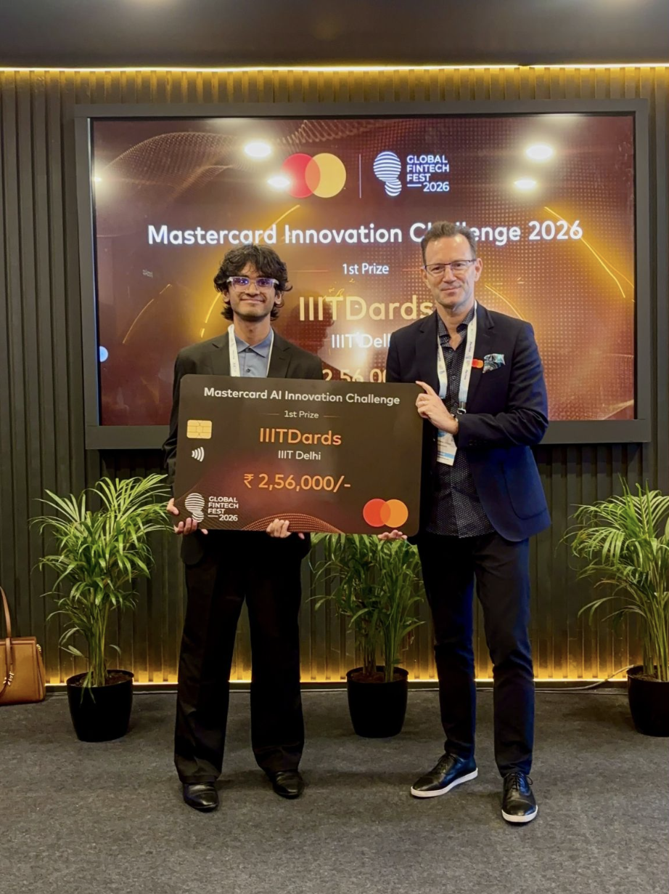

# Mastercard Innovation Challenge @ GFF 2026
### AI Defense Lab for Payment Security

**Build the attack, then build the defense.**

GenAI is making payment fraud faster, cheaper, and harder to spot. In this red team / blue team challenge, participants took on both sides of the problem by building one end-to-end Red Teaming AI system that:

- **Identifies** novel, emerging GenAI-powered payment fraud attacks,
- **Generates** realistic simulations of those attacks at scale, and
- **Defends** against them with an accurate detection model.

**Goal:** build a closed-loop AI system that discovers emerging GenAI payment fraud, recreates it with high fidelity, and reliably detects it — turning simulated attacks into the training ground for a stronger defense.

The challenge was hosted at [Global Fintech Fest (GFF) 2026](https://globalfintechfest.com/), Jio World Centre, Mumbai.

---

## Landing Page & Submissions

The challenge closed with **180 submissions from 345 unique institutions** across academia and industry — spanning startups, individual researchers, students, and financial institutions.

*1,154 entrants · 431 participants · 180 teams · 180 submissions*

---

## Hosts

---

## Organizing Team

The competition was organized end-to-end by a team led by **Shivam Arora**, covering:

- Designing the problem statement across the Identify → Generate → Defend pillars
- Identifying and setting up the platform to host the competition (Kaggle)
- Collaborating with the design team on LinkedIn creatives to drive participant sign-ups
- Ongoing communication with participants through the challenge lifecycle
- Evaluating submissions, including a final round of evaluation with senior management
- Declaring winners
- Arranging passes for the winning team to attend GFF 2026 in person

---

## Announcement

Hackathon champions were announced live on stage at GFF 2026.

---

## Winner

🏆 **1st Prize: IIITDards** (IIIT Delhi) — ₹2,56,000

